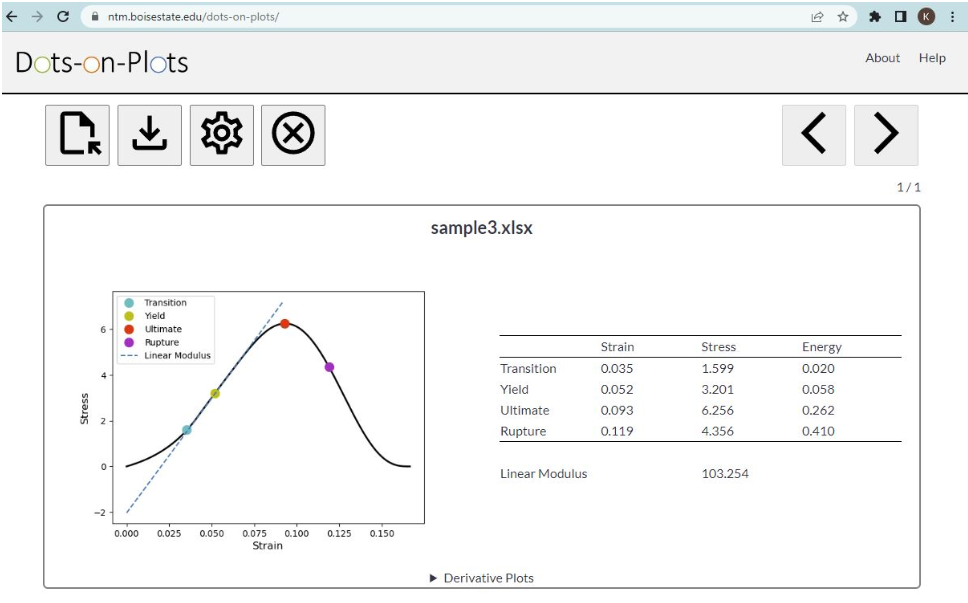

# dots-on-plots

## Description
[Dots-on-Plots](https://ntm.boisestate.edu/dots-on-plots/):tm: is a web application that calculates mechanical properties from stress-strain curves of soft tissue. A results summary table (.csv) and report summary document (.pdf) may be exported by the user. Multiple input files can be updated at one time.  

## File Requirements
Acceptable file types for input are .csv, .xls, and .txt. Data must consist of two equal length columns of numbers. One header row with strings can be included in the input file The first column of data will be plotted on the x-axis as strain. The second column of data will be plotted on the y-axis as stress.

## Publication
The journal article “Dots-on-Plots: A Web Application to Analyze Stress-Strain Curves From Tensile Tests of Soft Tissue” is currently under review in the Journal of Biomechanical Engineering.

## Website
The free web application can be found [here](https://ntm.boisestate.edu/dots-on-plots/).

## Source Code
The original Python source code is in src folder named dop.py on this GitHub page. 

## Documents
[Dots-on-Plots Video Tutorial](https://www.youtube.com/watch?v=QGsnZLlaksA)

## Support
If you have any questions or would like to report any bugs, please contact trevorlujan@boisestate.edu
